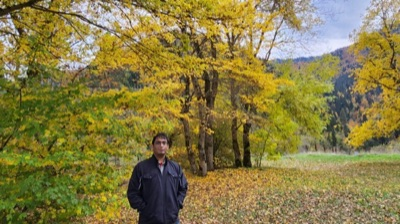

IITD e-mail : <code>cs1221594@iitd.ac.in</code>

Personal e-mail : <code>shahpoojan2004@gmail.com</code>

Phone : <code>+91 9924636975</code>

<a href="me.JPEG">[Me]</a>
<a href="cv.pdf">[CV]</a>
<a href="https://scholar.google.ca/citations?hl=en&view_op=list_works&gmla=AOv-ny_OFkMHrWUMPNHQCyvv05avR8LXUHY6vYYfLZpDepuWzLy1DVgpFu_KIZzge24Ap-uclYsDnkziNSYbtu0dH-nr&user=uedBN20AAAAJ">[Google Scholar]</a>

### About

I recently graduated from the [Department of Computer Science & Engineering](https://www.cse.iitd.ac.in/) at [IIT Delhi](https://home.iitd.ac.in/), with a semester at the [Faculty of Mathematics](https://uwaterloo.ca/math/) at the [University of Waterloo](https://uwaterloo.ca/). I have worked on clustering algorithms and quantum-inspired classical algorithms at [IIT Delhi](https://home.iitd.ac.in/) advised by [Ragesh Jaiswal](https://www.cse.iitd.ac.in/~rjaiswal/) and [Rajendra Kumar](https://k-rajendra.github.io/), on quantum cryptographic primitives at the [Computer Science Group](https://cs.quantumlah.org/) of [Centre for Quantum Technologies, NUS](https://www.quantumlah.org/) hosted by [Rahul Jain](https://www.comp.nus.edu.sg/~rahul/), on self-supervised learning at [Wadhwani AI](https://www.wadhwaniai.org/) hosted by [Makarand Tapaswi](https://makarandtapaswi.github.io/), and as a quantitative research intern at [Atlas Research](https://www.atlasresearch.ai/).

Outside research, I am a percussionist with a particular interest in Indian classical instruments, and write on my [personal blog](/blog) and [research blog](/research-blog).

### Publications

1. Fast k-means seeding under the manifold hypothesis 

Poojan Shah, Shashwat Agrawal and <a href="https://www.cse.iitd.ac.in/~rjaiswal/">Ragesh Jaiswal</a>

<strong>ICML 2026</strong> : The Forty Third International Conference on Machine Learning 

short description

We study fast k-means++ seeding under the assumption that data lies near a low-dimensional manifold. Traditional algorithm design often focuses on worst case guarantees, but real world data is often not worst case. We identify key geometrical scaling laws for clustering dependent on the intrinsic data dimension under the manifold hypothesis and show how to algorithmically exploit this structure to obtain fast seeding algorithms. We also perform an extensive empirical study to show the practical advantages of our algorithms. Our method has an \(O(\rho^{-2} \log k)\) approximation guarantee and runs in time \(\tilde{O}(nD) + \tilde{O}(k^{1 + \epsilon + \rho})\) where \(\rho < 1\) is a tuning parameter and \(\epsilon = 2/d\) is the quantization exponent.

<a href="https://arxiv.org/abs/2602.01104" class="btn-arxiv">arXiv</a>
<a href="https://arxiv.org/abs/2602.01104" class="btn-conf">OpenReview</a>

2. Quantum (inspired) D²-sampling with applications

Poojan Shah and <a href="https://www.cse.iitd.ac.in/~rjaiswal/">Ragesh Jaiswal</a>

<strong>ICLR 2025</strong> : The Thirteenth International Conference on Learning Representations

short description

We designed a quantum algorithm for D²-sampling (and through this, the first quantum approximation scheme for k-means with polylogarithmic running time in the Quantum RAM (QRAM) model) only to realise that (to put it bluntly in the words of a reviewer-2) "there is not much quantum here". This made us realise that, as with so many other Quantum Machine Learning (QML) algorithms in the QRAM model, our D²-sampling-based quantum clustering algorithms can also be dequantized in the sample-query access model of Ewin Tang <a href = "https://ewintang.com/assets/tang_thesis.pdf"> (PhD Thesis) </a>  to obtain a classical algorithm without much loss in the running time (unlike other QML dequantization results where there is a significant loss). We then realised that the dequantization, results in a fast implementation of k-means++, which has a lot of practical value.

<a href="https://arxiv.org/abs/2405.13351" class="btn-arxiv">arXiv</a>
<a href="https://openreview.net/forum?id=tDIL7UXmSS" class="btn-conf">OpenReview</a>
<a href="https://iclr.cc/virtual/2025/poster/28068" class="btn-poster">Poster</a>

### Preprints

1. A new rejection sampling approach to k-means++ with improved trade-offs

Poojan Shah, Shashwat Agrawal and <a href="https://www.cse.iitd.ac.in/~rjaiswal/">Ragesh Jaiswal</a>, 2025

short description

We propose a new rejection-sampling-based seeding algorithm for k-means++ that achieves improved trade-offs between running time and approximation quality, interpolating between the D²-sampling guarantee and a greedy optimum.

<a href="https://arxiv.org/abs/2502.02085" class="btn-arxiv">arXiv</a>

<h3>News</h3>

<ul>

<li> May 2026 Our work on beyond worst case clustering algorithms under the manifold hypothesis is accepted to <a href = "https://icml.cc/"> ICML 2026 </a> !  </li>

<li> Feb 2026 Glad to be invited for a lightning talk at <a href="https://event.india.acm.org/arcs/home/#arcs_about_2026">
ACM-ARCS 2026</a> and to attend the <a href="https://event.india.acm.org/annualevent/home/"> ACM India Annual Event

 </a> </li>
 <li> Jan 2026 Starting as TA for <a href="https://k-rajendra.github.io/courses/QuantumComputing/quantum252601.html">
COL7160 : Quantum Computing !</a>  </li>
<li>Dec 2025 I will be attending FSTTCS-2025 at BITS Goa !  </li>
<li>Nov 2025 Starting a collaboration with <a href="https://www.wadhwaniai.org/">Wadhwani AI</a>  for research on self supervised learning for anthropometry, under the guidance of <a href="https://makarandtapaswi.github.io/"> Makarand Tapaswi ! </a></li>
<li>Oct 2025 Our work was featured by CSE-IITD's blogpost ! Have a look at it <a href="https://homecse.iitd.ac.in/students-research-shines-at-iclr-2025/">here</a>. </li>
</ul>

### Research Interests

Broadly speaking, I am interested in the study of the world from a theoretical perspective. Specific interests, which tend to grow as time goes on include data clustering, quantum computing, statistical learning and algorithm design for modern information processing.

### Talks

1. Quantum and Quantum Inspired Classical Algorithms for Clustering

CS Group Meeting CQT - NUS, April 20, 2025

<a href="https://iclr.cc/virtual/2025/poster/28068" class="btn-poster">Poster</a>

2. Quantum Machine Learning without any Quantum

TCS Seminar, IIT Delhi — Bharti 501, November 4, 2024

<a href="https://drive.google.com/file/d/10hbt5_6Pd_qbcC5O_FxOspqenUsylO2V/view?usp=sharing" class="btn-slides">Slides</a>

### Teaching

Teaching Assistant for [COL7160 : Quantum Computing](https://k-rajendra.github.io/courses/QuantumComputing/quantum252601.html), Winter 2026
